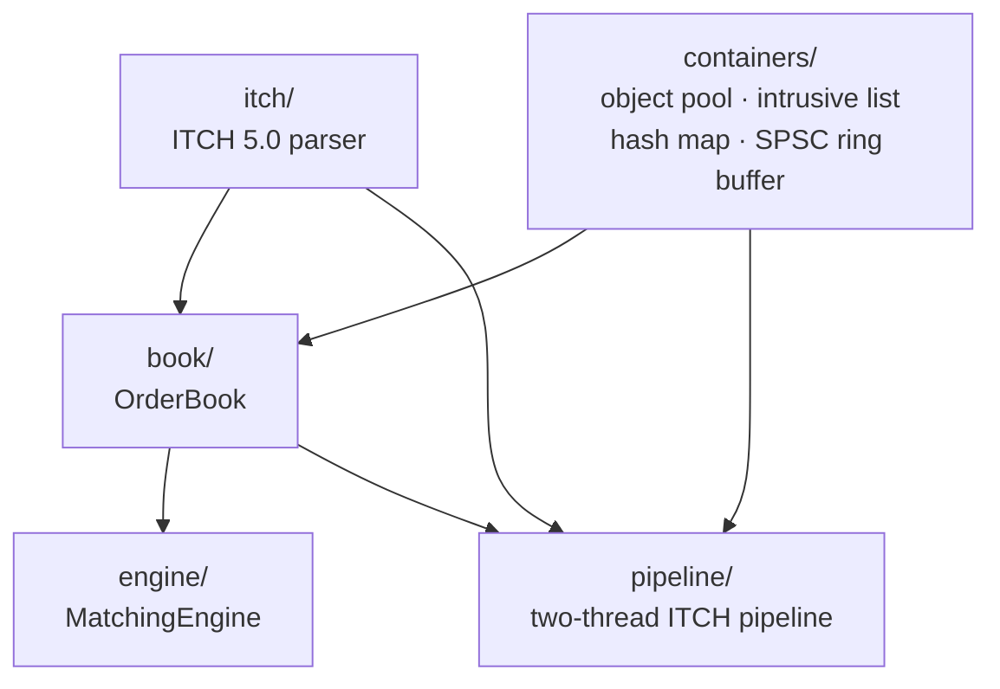

# liquibook-x

> A NASDAQ-style exchange core: an ITCH 5.0 feed handler, a low-latency limit order book, and
> a price-time-priority matching engine in C++20 — built and benchmarked with the same rigor
> real exchange/HFT infrastructure demands.

[](https://github.com/wuyutian4071/liquibook-x/actions/workflows/ci.yml)


**What / Why / Results (30-second version)**

- **What:** a real NASDAQ ITCH 5.0 binary protocol parser, a limit order book built for
  nanosecond-scale operations (intrusive containers, custom memory pools, zero hot-path heap
  allocation), and a matching engine supporting limit/market/IOC/FOK orders with price-time
  priority — plus lock-free thread handoff and rigorous latency benchmarking.
- **Why it's different:** this isn't a toy order book. Every performance claim is backed by a
  committed benchmark script (`bench/`), every correctness claim by a test that would actually
  fail if it were wrong (differential testing against a reference implementation, not just
  example-based tests), and the CI matrix runs sanitizer-clean (ASan/UBSan, TSan) across both
  gcc and clang. See [`DESIGN.md`](DESIGN.md) for the full reasoning behind every significant
  decision, including a catalog of real bugs this process caught.
- **Results:** ITCH decode at 112M messages/sec; sub-100ns P99 for `OrderBook` add/cancel/
  execute and `MatchingEngine` matches that don't empty a price level; a 140x-slower P50 for
  matches that *do* (an honestly-quantified, previously-only-qualitative design tradeoff);
  164M items/sec through the lock-free ring buffer's two-thread pipeline. Full methodology
  and every table — see **[`BENCHMARKS.md`](BENCHMARKS.md)**.

## Contents

- [Architecture](#architecture)
- [Status](#status)
- [Quickstart](#quickstart)
- [The ITCH 5.0 parser (M2)](#the-itch-50-parser-m2)
- [Foundational containers (M3)](#foundational-containers-m3)
- [The order book (M4)](#the-order-book-m4)
- [The matching engine (M5)](#the-matching-engine-m5)
- [Concurrency: the SPSC ring buffer and two-thread pipeline (M6)](#concurrency-the-spsc-ring-buffer-and-two-thread-pipeline-m6)
- [The benchmark suite (M7)](#the-benchmark-suite-m7)
- [Design principles](#design-principles)
- [License](#license)

## Architecture



`itch/` and `containers/` are independent leaves with no dependency on each other. `book/`
is the first module to combine them. `engine/` builds on `book/` alone. `pipeline/` depends
on all three directly — its consumer thread calls `OrderBook::apply()`, not
`MatchingEngine::submit()` (see [the M6 section](#concurrency-the-spsc-ring-buffer-and-two-thread-pipeline-m6)
for why). This is the actual dependency graph, read from every module's `CMakeLists.txt`,
not an idealized one.

## Status

Built milestone by milestone, all eight complete.

| Milestone | Scope | State |
|-----------|-------|-------|
| M1 | Repo skeleton, CMake, CI (gcc+clang, Debug+ASan/UBSan, Release), clang-format | ✅ |
| M2 | ITCH 5.0 parser + synthetic data generator + parser throughput benchmark | ✅ |
| M3 | Object pool, intrusive list, open-addressing hash map | ✅ |
| M4 | OrderBook with ITCH-driven book building + differential tests vs. a reference `std::map` book | ✅ |
| M5 | MatchingEngine: limit/market/IOC/FOK, price-time priority | ✅ |
| M6 | Lock-free SPSC ring buffer + two-thread pipeline + TSan | ✅ |
| M7 | Full benchmark suite + `BENCHMARKS.md` (methodology + results) | ✅ |
| M8 | Polished README, architecture diagram, design-decisions doc | ✅ |

## Quickstart

```bash
cmake -S . -B build -G Ninja -DCMAKE_BUILD_TYPE=Debug -DENABLE_ASAN=ON -DENABLE_UBSAN=ON
cmake --build build
ctest --test-dir build --output-on-failure

# Parser throughput benchmark (Release, no sanitizers -- their overhead would make the
# numbers meaningless):
cmake -S . -B build-release -DCMAKE_BUILD_TYPE=Release -DLIQUIBOOK_BUILD_BENCHMARKS=ON
cmake --build build-release
./build-release/bench/liquibook_bench_parser
```

## The ITCH 5.0 parser (M2)

`itch/decode.hpp` decodes NASDAQ TotalView-ITCH 5.0's binary protocol for the 10 message
types this project needs. `decode()` takes a raw byte span and an already-known type/length
(validated against each type's documented `wire_length()`) and returns a `DecodedMessage` —
a raw `union`, not a `std::variant` (see [DESIGN.md](DESIGN.md#itch-messages-a-raw-union-not-stdvariant)
for why). `noexcept` throughout: an unrecognized type or a too-short span returns
`std::nullopt`, never UB.

`itch/file_reader.hpp`'s `ItchFileReader` memory-maps a length-prefixed ITCH file
(`[2-byte length][message]`, repeated) and walks it with zero copies.

`itch/synth.hpp`'s `generate()` produces a deterministic, seeded synthetic order-flow stream
for testing and benchmarking without needing a real NASDAQ sample file: every Order
Executed/Cancel/Delete/Replace message references an order a prior Add Order in the same
stream actually created and hadn't yet fully removed — checked not by trusting the
generator's own bookkeeping but by replaying the real `decode()` over its output in
`test_synth_roundtrip.cpp` and independently verifying the invariant holds.

**Measured, not assumed**: `bench_parser` reports ~112M messages/sec decode throughput —
decode-only, not the full file-read+decode+book-update pipeline. Per-operation latency
percentiles for every other subsystem, with full methodology, are in `BENCHMARKS.md` (M7).

## Foundational containers (M3)

`containers/object_pool.hpp`'s `ObjectPool<T>`, `containers/intrusive_list.hpp`'s
`IntrusiveList<T>`, and `containers/hash_map.hpp`'s `OpenAddressingHashMap<K, V>` are the
three allocation-free data structures `OrderBook` (M4) is built from. See
[DESIGN.md](DESIGN.md#zero-allocation-containers-intrusive-lists-and-object-pools) for why
each exists and why open addressing over chaining for the hash map. The hash map is verified
with a differential stress test against `std::unordered_map` (2,000 random keys, checked at
every step); `ObjectPool` and the hash map's zero-heap-allocation claim is directly proven,
not assumed, by `testing/allocation_guard.hpp`'s scoped allocation counter.

## The order book (M4)

`book/order_book.hpp`'s `OrderBook` is the first module to consume M2's ITCH messages and
M3's three containers together. Price levels live in a flat array with a `std::map`
fallback for outliers, and best bid/ask are cached and updated incrementally rather than
scanned — see [DESIGN.md](DESIGN.md#price-levels-flat-array--fallback-map-and-what-tick-means-here)
and [DESIGN.md](DESIGN.md#best-bidask-an-incremental-cache-with-a-bounded-rescan) for the
reasoning, including what "tick" means in this codebase specifically.

Three kinds of verification, matching the milestone's own requirements:
- **Direct unit tests** (`test_order_book.cpp`) — add/execute/cancel/delete/replace
  correctness, best-bid/ask transitions including the level-empties-and-walks case, and the
  flat-array/fallback-map boundary exactly at the edge of the window.
- **A differential test** (`test_order_book_differential.cpp`) against a deliberately simple,
  obviously-correct `ReferenceOrderBook` (plain hash map, O(n) scans) — a random,
  self-consistent stream of operations applied to both books in lockstep, comparing best
  bid/ask, order count, and shares at *every* price the run ever touched (not just top of
  book) after every single operation.
- **An ITCH-driven integration test** (`test_order_book_itch_integration.cpp`) — a real
  synthetic ITCH stream (M2's `generate()`), decoded with M2's real `decode()`, fed through
  `OrderBook::apply()` end to end, checked against independently-tracked expected state.

## The matching engine (M5)

`engine/matching_engine.hpp`'s `MatchingEngine` decides how an *incoming* order interacts
with the book — the piece M4 deliberately didn't build: `OrderBook` maintains resting state,
but has no notion of "does this new order cross, and against whom." Four order types, each
with its own remainder rule: `Limit` rests any unfilled quantity; `Market` and `IOC` discard
it; `FOK` fills completely or not at all, verified atomic via a read-only dry run before any
mutation (see [DESIGN.md](DESIGN.md#fill-or-kill-a-read-only-dry-run-before-any-mutation)).
Self-trade prevention, off by default, *skips* a blocked resting order rather than cancelling
it (see [DESIGN.md](DESIGN.md#self-trade-prevention-skip-not-cancel)). The event callback
interface is a compile-time template parameter, not `std::function` or CRTP (see
[DESIGN.md](DESIGN.md#matchingengines-callback-a-compile-time-template-not-stdfunctioncrtp)).

Verification: 17 direct scenario tests (partial/exact fills, multi-level walks, FIFO priority
verified via fill order not just final state, Market/IOC partial-fill-then-discard, FOK
success/failure/price-limit-respected, self-trade prevention on/off/no-other-liquidity/zero-
trader-id, and STP's effect on the FOK liquidity check specifically) plus a conservation test
(`test_matching_engine_conservation.cpp`) — 500 random orders across all four types, asserting
every single `submit()` call's incoming quantity is accounted for exactly once as filled,
rested, or killed, a property that must hold for *any* correct matching engine regardless of
implementation strategy.

## Concurrency: the SPSC ring buffer and two-thread pipeline (M6)

`containers/spsc_ring_buffer.hpp`'s `SpscRingBuffer<T>` is this project's first genuinely
concurrent code — single-producer/single-consumer, needing no CAS, with cache-line-padded
indices and no read/write-index wraparound ambiguity (see
[DESIGN.md](DESIGN.md#the-spsc-ring-buffer-no-cas-cache-line-padding-monotonic-indices) for
the full reasoning).

`pipeline/itch_pipeline.hpp`'s `run_itch_pipeline()` puts it to real use: a producer thread
decodes a real ITCH stream with M2's `decode()` and pushes each message into the buffer; a
consumer thread pops and applies each one to an `OrderBook` via M4's real `apply()` —
decoupling parsing from book-building onto separate threads, the realistic architecture a
real feed handler uses so a slow matching/book-building thread never blocks the parser, and
vice versa. (ITCH replay is book-*building* — replaying what a real exchange already
decided — not matching, which is why the consumer calls `OrderBook::apply()` rather than
`MatchingEngine::submit()`, a different input type entirely.)

**Verified where it counts**: a dedicated `tsan` CI job builds the whole suite with
`-fsanitize=thread` and runs it on real Linux hardware — this is what actually proves the
acquire/release reasoning is correct, not just plausible-sounding. The concurrent tests
themselves are deliberately adversarial: `SpscRingBuffer`'s own stress test drives 200,000
items through a capacity-64 buffer (constant wraparound, not a rare edge case); the pipeline
test uses a capacity-32 buffer so the two threads genuinely contend rather than the producer
racing ahead and finishing first.

## The benchmark suite (M7)

M2's `bench_parser.cpp` already answers "how many messages/sec" via a Google Benchmark
throughput loop. `bench/latency_histogram.hpp`'s `LatencyHistogram` answers a different
question — "what's the P99.9 latency of one operation" — by timing each operation
individually and sorting the resulting samples, infrastructure Google Benchmark's own
loop-average model doesn't provide.

Three custom-harness executables apply it: `bench_order_book_latency`
(`add_order`/`cancel_order`/`execute_order`/`best_bid`/`shares_at`),
`bench_matching_engine_latency` (`submit()` for a full match, a rest-only Limit, and an IOC
partial fill, measured separately since they take genuinely different code paths), and
`bench_ring_buffer_latency` (single-threaded `push`/`pop`, plus a real two-thread
sustained-throughput run).

**A design tradeoff, previously only qualitative, is now empirically quantified**: matching
scenarios that empty a price level measure roughly 140x slower than one that just rests —
the real, measured cost of `OrderBook`'s documented bounded-rescan behavior. Full explanation
and every number: **[`BENCHMARKS.md`](BENCHMARKS.md)**.

## Design principles

1. **Correctness first, then measured performance.** No latency claim ships without a
   benchmark in the repo backing it.
2. **Zero heap allocation on the hot path.** Verified, not assumed — object pools and
   intrusive containers throughout; `testing/allocation_guard.hpp`'s counting allocator
   asserts this directly in `containers/tests/` (M3).
3. **No locks on the hot path.** Thread handoff uses a lock-free SPSC ring buffer, TSan-
   verified in CI (M6).
4. **Mechanical sympathy.** Cache-line-aware layout, branch-prediction-conscious code,
   documented and benchmarked, not just asserted in a comment — the SPSC ring buffer's
   cache-line-padded indices (M6) are the first concrete instance of this, not just a claim.

## License

MIT — see [LICENSE](LICENSE).
